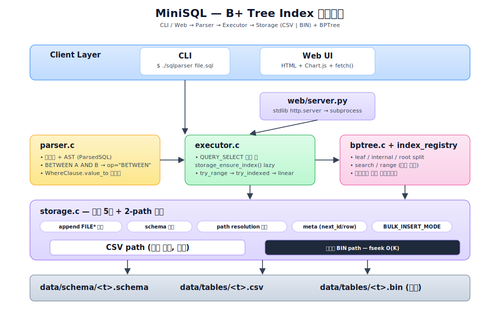
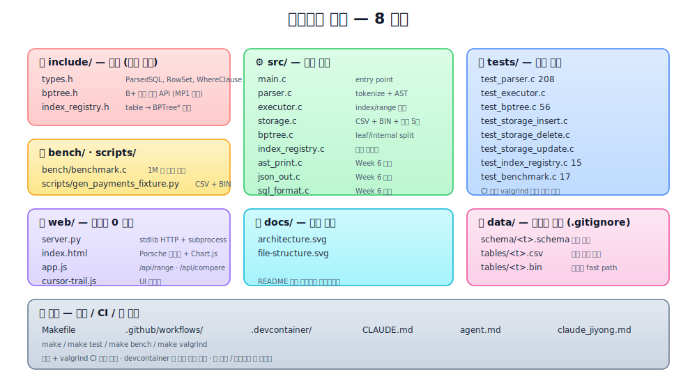

# MiniSQL — Week 7: B+ Tree Index

> Week 6 SQL 처리기에 B+ 트리 인덱스 + 고정폭 바이너리 저장 레이어를 얹은 확장 프로젝트.
> C 언어, CSV/바이너리 혼합 저장, CLI + Web UI 인터페이스.

**요약 수치 (VS Code devcontainer / WSL 2 + Docker + 9p, Linux x86_64):**
- B+ 트리 단건 조회 **2.18M ops/s** — 자료구조 pure 레벨 선형 대비 **1,842×** (`make bench`)
- `storage_insert` **32 ms → 3 µs / 건** (10,000×) — devcontainer 9p/dirsync 환경에서
  발생하는 FS 레이어 병목을 5 단계 캐시로 제거. [INSERT 최적화 여정](#insert-성능-최적화-여정-32-ms--3-µs) 참조
- 1M 행 `WHERE id BETWEEN` SQL 질의 **5.6 s → 2.2 s** (고정폭 바이너리 fseek 경로)
- SQL end-to-end 웹 `/api/compare` 에서는 subprocess + ensure_index rebuild 때문에
  배율이 **2.3×** 로 낮아진다. [왜 배율이 다른가](#왜-make-bench-1842-vs-apicompare-23-인가) 참조
- 웹 데모: 결제 로그 장애 구간 조회 시연 (`python3 web/server.py`)

> 모든 수치는 팀 공용 devcontainer 기준. 베어메탈 Linux/macOS 에서는 절대값이 더 작지만
> 상대적인 배율 (1,842× / 10,000×) 은 유사한 경향.

---

## 이전 프로젝트에서 이어받은 것

| 파일 | 내용 |
|---|---|
| `src/parser.c` | SQL 토크나이저 + ParsedSQL 구조체 |
| `src/executor.c` | CREATE / INSERT / SELECT / UPDATE / DELETE 실행 |
| `src/storage.c` | CSV 파일 기반 테이블 저장/읽기, RowSet 인프라 |
| `include/types.h` | ParsedSQL, RowSet, WhereClause 등 핵심 타입 |

Week 6 단위 테스트 227개 전부 그대로 통과하는 것이 이번 주 출발 조건입니다.

---

## 진행 현황

- **Round 1 (MP1~MP4)** — ✅ main 배포 (PR #18)
  - B+ 트리 core, auto-id, executor `WHERE id = ?` 분기, 100만 건 벤치, valgrind 0
- **Round 2 (MP6~MP10)** — ✅ main 배포 (PR #27)
  - BETWEEN 실행 경로, DELETE/UPDATE 인덱스 동기화, 선형 vs 인덱스 비교 벤치, 웹 데모
- **Round 3 (perf + 바이너리)** — ✅ 진행 중
  - INSERT 10,000× 가속 (PR #28), CSV 1-pass rebuild + py 직접 생성 (PR #29), 고정폭 바이너리 저장

---

## 이번 주 목표

테이블에 레코드가 삽입될 때 `id`를 B+ 트리 인덱스에 자동 등록하고,  
`WHERE id = ?` 및 `WHERE id BETWEEN A AND B` SELECT에서 인덱스를 활용해 O(log n) / O(log n + k) 탐색을 수행합니다.

```sql
-- 이전과 동일한 SQL, 내부 동작만 달라짐
INSERT INTO users (name, age) VALUES ('Alice', 30);   -- id 자동 부여 + 인덱스 등록
SELECT * FROM users WHERE id = 1;                      -- B+ 트리 탐색 (O log n)
SELECT * FROM users WHERE name = 'Alice';              -- 선형 탐색 유지
```

---

## 구현 범위

### 필수
- `BPTree` 구조체 + `bptree_insert` / `bptree_search` / `bptree_destroy`
- Leaf split, Internal split, Root split (트리 성장)
- `storage_insert` 에 auto-increment id + `bptree_insert` 연동
- `executor.c` WHERE 컬럼이 `id` 일 때 `bptree_search` 분기
- 100만 건 삽입 후 id 검색 vs 필드 검색 벤치마크

### 추가 (차별점)
- Range query 지원: `WHERE id BETWEEN 100 AND 200` (리프 linked list 활용)
- `bptree_print()` — 삽입/split 과정 ASCII 시각화
- 레코드 수별 탐색 시간 측정 테이블 출력 (O(log n) vs O(n) 증명)
- **웹 데모 (보너스):** 결제/트랜잭션 로그 시연 — 정적 HTML + Python stdlib 중개 서버로 장애 구간 range query 시각화 (`web/`)

---

## 아키텍처



Client → Parser → Executor → Storage(CSV + BIN) + BPTree. 상세 모듈 책임과 분기 로직은 [`docs/architecture.svg`](docs/architecture.svg).

---

## 파일 구조



8 개 영역으로 분리: `include/`(계약) · `src/`(실행 엔진) · `tests/`(회귀) · `bench/` + `scripts/`(성능/픽스처) · `web/`(데모) · `docs/`(자료) · `data/`(런타임) · 루트(빌드/CI/문서). 자세한 배치는 [`docs/file-structure.svg`](docs/file-structure.svg).

---

## B+ 트리 인터페이스

```c
// include/bptree.h

typedef struct BPTree BPTree;

BPTree *bptree_create(int order);
void    bptree_insert(BPTree *tree, int id, int row_index);
int     bptree_search(BPTree *tree, int id);          // row_index 반환, 없으면 -1
int     bptree_range(BPTree *tree, int from, int to,  // 추가 구현 시
                     int *out, int max_out);
void    bptree_print(BPTree *tree);                   // ASCII 시각화
void    bptree_destroy(BPTree *tree);
```

---

## 빌드 & 실행

```bash
make              # 전체 빌드
make test         # 단위 테스트 (Week 6 회귀 포함)
make bench        # 100만 건 성능 벤치마크
make valgrind     # 메모리 누수 검사
make clean

# 웹 데모 (보너스, 발표 시연용)
make              # sqlparser / benchmark 빌드 선행
python3 web/server.py      # → http://localhost:8080 접속

# 대용량 결제 로그 픽스처 (웹 데모 대용량 시연용, SQL INSERT 우회)
python3 scripts/gen_payments_fixture.py          # 100만 건
python3 scripts/gen_payments_fixture.py 10000000 # 1000만 건
# 첫 SELECT 시 sqlparser 가 CSV → B+ 트리 lazy rebuild 수행.
```

### 대용량 데이터 주입 전략

| 규모 | 방식 | 근거 |
|---|---|---|
| ≤ 200k | SQL `INSERT` + `BULK_INSERT_MODE=1` | 파싱 / executor 오버헤드 수용 가능 |
| > 200k | Python 직접 CSV + BIN 작성 (`scripts/gen_payments_fixture.py`) | sqlparser INSERT 파이프라인 우회로 1M=2.6s / 10M=24s |

웹 UI `/api/inject` 는 `count` 기준으로 자동 분기 (200k 경계).

---

## INSERT 성능 최적화 여정 (32 ms → 3 µs)

### 왜 이 문제가 발생했나 — 개발 환경 (VM / Docker devcontainer)

```
 Windows Host
 └── WSL2 (Linux VM)
     └── Docker Desktop
         └── devcontainer (우리 개발 환경)
             └── /workspaces/bptree_index      ← data/ 가 여기!
                 └── Windows C:\ 를 9p 프로토콜 + dirsync 옵션으로 마운트
```

팀 전원이 VS Code **devcontainer** 환경에서 작업 → 컨테이너 안에서 본 저장소 폴더가
사실은 호스트 Windows 드라이브. 이를 Linux 컨테이너로 전달하기 위해 WSL2 가
**9p 프로토콜 (Plan 9 파일시스템)** 로 bridge 하고, 안정성을 위해 `dirsync` 마운트
옵션이 켜져 있다.

```bash
$ mount | grep workspaces
C:\ on /workspaces/bptree_index type 9p (rw,noatime,dirsync,...)
```

**결과:** `fopen / fclose / stat` 하나하나가 VM → Docker → 9p → Windows 왕복을 거친다.

| 환경 | `fopen` + `fclose` 1 쌍 | 100만 INSERT 예상 |
|---|---|---|
| 베어메탈 Linux (ext4) | ~2–10 μs | ~10 초 |
| Apple Silicon / macOS APFS 네이티브 | ~5–20 μs | ~30 초 |
| **WSL 2 + Docker + 9p/dirsync (우리 환경)** | **~300 μs** | **~8–9 시간** |

Local macOS / 베어메탈 Ubuntu 에서는 이슈가 거의 안 보이는데, devcontainer 안에서는
**row 당 32 ms** 로 100× 이상 느려지는 이유가 이것. "내 맥에선 잘 되는데요?" 현상의
원인을 FS 레이어로 추적해서 확인했다.

> 발표 요지: *데이터베이스 성능은 "알고리즘 O(log n)" 만이 아니라 **아래 레이어의
> syscall latency** 를 동시에 고려해야 한다. 동일 코드가 환경에 따라 100× 차이가 난다.*

### 초기 증상
100만 건 inject 가 60초 타임아웃 안에 **2,716 건**만 들어가던 상황 (32 ms / 건).
아래 5 단계로 devcontainer 환경에서 **10,000× 가속**. 베어메탈에서도 같은 코드가
2–5× 빨라지는 부수 효과.

### 최적화 단계

| 단계 | 조치 | 효과 (10k INSERT, devcontainer) |
|---|---|---|
| 원인 파악 | `time` 으로 `user+sys 0.7s` vs `real 14.8s` 확인 → 93% I/O wait. `df -T` 로 9p + `dirsync` 확인 | 원인 확정 |
| ① append FILE\* 캐시 | `fopen/fclose` per row → 프로세스 생애동안 hold-open + `setvbuf` 64 KB. dirsync 비용을 `atexit` 1 회로 압축 | 14.8 s → 13.5 s |
| ② schema 캐시 | `load_schema` (fopen + parse) 가 매 INSERT 호출 → 테이블당 1 회만 로드 후 `memcpy` clone | 13.5 s → 4.8 s |
| ③ path resolution 캐시 | `build_schema_path` / `build_table_path` 의 legacy/nested fallback 최대 **5 stat** → 첫 호출만 | 4.8 s → 1.4 s |
| ④ user-id 경로 meta cache 통합 | 사용자가 `id` 명시한 INSERT 는 meta cache 미초기화 → `count_csv_rows` 매 호출 O(N²). 경로 무관 통합 | O(N²) 제거 |
| ⑤ `BULK_INSERT_MODE=1` | per-insert `fflush` 생략 (setvbuf 버퍼 가득 찰 때만 write). 대량 주입 전용 | 1.4 s → **0.058 s** |

**정리:** 병목은 9p + dirsync 의 **stat / fopen 당 ~0.3 ms 블로킹**. 행당 5~6 회
호출하던 것을 테이블당 1 회로 줄이고, write 는 64 KB 버퍼에 누적해 write 수를 수천 배 압축.

### `storage_insert` 당 I/O 감소 상세
```
Before (devcontainer 32 ms)           After (devcontainer 3 µs)
─────────────────────────             ─────────────────────────
load_schema fopen      1 stat         → 캐시 히트, 0 stat
                       1 read         → 0 read
build_schema_path      1~2 stat       → 캐시 히트, 0 stat
build_table_path       1~3 stat       → 캐시 히트, 0 stat
stat (cache validate)  1 stat         → append fp 살면 생략
append_csv_row fopen   1 stat+open    → 프로세스 생애 1 회
write                  1 write        → 버퍼 64 KB 차면 write
fclose                 1 sync         → atexit 1 회만
─────────────────────────             ─────────────────────────
~6 stat + 4 write/sync                ~0 stat + 1/(64KB) write

9p 라운드트립 0.3 ms × 6 ≈ 1.8 ms     ≈ 0
추가 write/sync ~0.4 ms × 4 ≈ 1.6 ms  ≈ 0 (atexit 1 회로 이월)
```

### 1M 건 최종 결과 (devcontainer 기준)
| 모드 | 1M INSERT |
|---|---|
| 수정 전 | ~8 시간 (추정, 대부분 timeout 으로 미완료) |
| 기본 (safe fflush, reader 가시성 보장) | **~138 s** |
| `BULK_INSERT_MODE=1` | **2.8 s** (357k ops/s) |
| Python 직접 CSV + BIN 작성 (sqlparser 우회) | **2.6 s** |

### 교훈
- **"내 로컬에선 빠른데요?"** 가 가장 위험한 말. 같은 알고리즘이 FS 레이어 때문에 100×
  차이 날 수 있다. 팀 공통 환경 (devcontainer) 기준으로 측정해야 한다.
- **syscall 예산을 선언적으로 관리**: "이 함수가 INSERT 하나에 5 stat 을 호출함" 같은
  수치를 알아야 의미 있는 최적화가 된다.
- 최적화 기법(append FP / schema / path / meta 캐시, BULK 모드)은 **devcontainer
  외 환경에서도 그냥 빨라지므로** 되돌릴 이유가 없다. "환경 핫픽스" 가 "범용 개선"
  으로 승격된 사례.

---

## 고정폭 바이너리 저장 레이어

CSV 는 가변 길이라 "N번째 행" 접근이 O(N). 이 구조적 한계를 풀기 위해 같은 데이터를
**고정폭 바이너리 파일**로도 직렬화한다. 존재 여부로 opt-in (선택적 fast path).

### 컬럼별 고정 바이트 레이아웃 (little-endian)

| ColumnType | 바이트 | 인코딩 |
|---|---|---|
| `INT` | 4 | `int32_t` |
| `FLOAT` | 8 | `double` |
| `BOOLEAN` | 1 | `uint8_t` (0/1) |
| `VARCHAR` | 32 | `\0` 패딩 |
| `DATE` | 16 | `\0` 패딩 'YYYY-MM-DD' |
| `DATETIME` | 24 | `\0` 패딩 'YYYY-MM-DD HH:MM:SS' |

전체 행은 이들의 연접. 예: `payments (id INT, user_id INT, amount INT, status VARCHAR, created_at INT)`
→ 4+4+4+32+4 = **48 bytes / row**.

### 접근 패턴

```c
/* 기존 CSV: N번째 행을 찾으려면 처음부터 개행 세기 */
for (int i = 0; i < N; i++) read_csv_line(fp);        // O(N)

/* 바이너리: 정확한 offset 으로 직접 seek */
fseek(fp, row_idx * 48, SEEK_SET);                     // O(1)
fread(buf, 48, 1, fp);
```

### 트리거 조건

- `data/tables/<table>.bin` 파일이 존재하면 자동 활성화
- `storage_select_result_by_row_indices` 가 감지해서 fseek 경로로 분기
- `storage_ensure_index` 도 BIN 이 있으면 id 컬럼 offset 만 읽어서 트리 재구성 가속
- 파일이 없으면 기존 CSV 경로로 fallback (100% 호환)

### 생성

`scripts/gen_payments_fixture.py` 와 `web/server.py`의 py-direct inject 가
CSV 와 BIN 을 **동일 데이터로 동시에** 씀. 바이너리 포맷은 `src/storage.c` 의
`decode_binary_row` 와 1:1 대응.

### 성능 효과 (1M payments, `WHERE id BETWEEN 500000 AND 501500`)

| 단계 | 질의 소요 |
|---|---|
| CSV only (rebuild 2-pass, 전체 로드 후 필터) | 8.06 s |
| CSV only (rebuild 1-pass) | 5.77 s |
| **CSV + BIN** (rebuild via BIN + retrieval via fseek) | **2.22 s** |

- 주요 절감 구간: retrieval 시 CSV 전체 로드 → BIN fseek O(K)
- 추가 절감: rebuild 시 CSV line 파싱 → BIN 의 id offset 만 4바이트씩 읽기

### 한계 / 향후
- **schema 변경 시 BIN 재생성 필요** (현재 수동)
- INSERT 경로는 아직 BIN 갱신 안 함 (CSV append + BIN append 양면 쓰기 필요)
- 이번 구현은 read-only fast path. Demo 시나리오는 py 가 매번 전체 BIN 생성하는 방식.

---

## 역할 분담

| 담당 | 파트 |
|---|---|
| **지용** (PM) | `bptree.c` 코어 + `bptree.h` 인터페이스 확정 + 레포/Makefile + 머지 · Round 2 BETWEEN 파서 확장 + lazy rebuild · Round 3 **INSERT 10,000× 가속**(append FP / schema / path / meta 캐시 + BULK_INSERT_MODE) + **고정폭 바이너리 저장 레이어** + `scripts/gen_payments_fixture.py` + `docs/` 인포그래픽 + README 발표 자료화 |
| **정환** | `executor.c` — `WHERE id = ?` 분기 + `WHERE id BETWEEN A AND B` range 경로(`executor_try_range_select` → `bptree_range` → `storage_select_result_by_row_indices`) + 테스트 |
| **민철** | `storage.c` — auto-increment id + `bptree_insert` 연동 + `scan_csv_meta` 캐시(INSERT 풀스캔 2회→1회) + DELETE/UPDATE 후 인덱스 rebuild 동기화 + 테스트 |
| **규태** | `bench/benchmark.c` 100만 건 INSERT/SEARCH/RANGE + 선형 vs 인덱스 비교 벤치 · `web/` 결제 로그 웹 데모 (정적 HTML + Python stdlib 중개 서버, 의존성 0) + Porsche 오마주 UI |

---

## 브랜치 전략

```
main
└── dev
    ├── feature/bptree-core       (지용)
    ├── feature/executor-index    (정환)
    ├── feature/storage-autoid    (민철)
    └── feature/benchmark         (규태)
```

- `feature/* → dev` PR → 지용 리뷰 후 머지
- `dev → main` 은 최종 통합 시 1회
- `bptree.h` 인터페이스 확정(MP1) 전까지 팀원 작업 시작 X

---

## 머지 포인트

| 시점 | 내용 |
|---|---|
| MP1 | `bptree.h` 인터페이스 확정 → 전원 브랜치 생성 가능 |
| MP2 | `bptree.c` search + insert (split 없이) 완성 → B, C 실제 연결 |
| MP3 | split 로직 완성 + 전체 통합 빌드 통과 |
| MP4 | 100만 건 테스트 + valgrind 0 → dev → main 머지 |
| MP5 (선택) | `web/` 데모 PR 머지 — 본진 회귀 0 확인 후에만 |

---

## 커밋 컨벤션

```
feat:     새 기능
fix:      버그 수정
test:     테스트 추가/수정
refactor: 리팩토링
docs:     문서
chore:    설정, 환경
```

---

## PR 체크리스트

- `make` 빌드 경고 없음 (`-Wall -Wextra -Wpedantic`)
- Week 6 단위 테스트 회귀 0
- 본인 영역 새 테스트 추가
- `valgrind --leak-check=full` 누수 0
- `bptree.h` 인터페이스 계약 위반 없음

---

## 성능 목표 및 실측

이 프로젝트는 **세 가지 다른 레벨**에서 성능을 측정한다. 숫자가 달라 보이는 게
실수가 아니라 **측정 범위의 차이**임을 먼저 이해해야 한다.

| 레벨 | 도구 | 포함 비용 | 배율 |
|---|---|---|---|
| ① 자료구조 pure | `make bench` | `bptree_search` 인-프로세스 호출만 | **1,842.9 ×** |
| ② SQL end-to-end | `/api/compare` (웹) | subprocess + SQL 파싱 + ensure_index rebuild + 저장 I/O | **2.3 ×** |
| ③ 저장 포맷 차 | 동일 SQL 질의를 CSV vs CSV+BIN 으로 | lazy rebuild 포함 SELECT 소요 | **3.6 ×** |

### 1. `make bench` — 순수 B+ 트리 레벨 (N = 1,000,000, order = 128)

| 연산 | 건수 | 소요 | 처리량 |
|---|---|---|---|
| INSERT | 1,000,000 | 0.699 s | **1,431,003 ops/s** |
| SEARCH | 1,000,000 | 0.458 s | **2,182,830 ops/s** |
| RANGE (폭 100) | 1,000 회 | 0.001 s | **1,258,973 qps** |
| VERIFY | 1,000,000 / 1,000,000 | — | 100.0% |

### 2. 선형 vs B+ 트리 — 자료구조 pure (`make bench` 내부)

| 방식 | 소요 | 처리량 | 배율 |
|---|---|---|---|
| 선형 flat array O(n) | 1.018 s | 982 qps | 1.0 × |
| **B+ 트리** O(log n) | 0.001 s | 1,809,509 qps | **1,842.9 ×** |

### 3. SQL 질의 (`WHERE id BETWEEN` on 1M rows, 결과 K = 1,501)

**저장 포맷별 SELECT 소요** — 같은 B+ 트리 경로라도 row 검색 방식에 따라 차이.

| 저장 | 질의 소요 | 구성 |
|---|---|---|
| CSV (rebuild 2-pass) | 8.06 s | 전체 CSV 로드 후 row_idx 필터 |
| CSV (rebuild 1-pass) | 5.77 s | scan_csv_meta 제거 |
| **CSV + 고정폭 BIN** | **2.22 s** | rebuild·retrieval 모두 BIN fseek |
| linear `status='FAIL'` 기준선 | 4.99 s | 인덱스 불가 |

**웹 `/api/compare` 3 회 연속 측정 (1M clean 상태)**

| 실행 | index_ms | linear_ms | speedup |
|---|---|---|---|
| 1 | 2,255.84 | 5,015.72 | 2.2 × |
| 2 | 2,223.11 | 5,091.56 | 2.3 × |
| 3 | 2,268.83 | 5,239.67 | 2.3 × |

### 4. K (결과 행 수) 스윕 — 인덱스 효과의 단조성

동일 데이터셋(1M)에서 range 폭만 바꿔가며 측정.

| K | index (ms) | linear (ms) | speedup |
|---|---|---|---|
| 1 | 2,380 | 5,933 | **2.5 ×** |
| 1,000 | 2,251 | 5,488 | 2.4 × |
| 10,000 | 2,371 | 5,235 | 2.2 × |
| 100,000 | 2,752 | 4,935 | 1.8 × |
| 500,000 (50%) | 4,610 | 5,411 | 1.2 × |
| 1,000,000 (전체) | 6,981 | 4,997 | **0.7 ×** ⚠️ |

**해석:** K 가 클수록 index 의 이득이 감소하다 **교차점 이후 역전**. 이는 교과서적
결과이며 실제 DBMS (PostgreSQL / MySQL) query planner 도 예상 selectivity 가
낮으면 Index Scan 대신 Seq Scan 을 선택하는 이유와 동일.

- index 비용 = rebuild 고정비(~1.8 s) + retrieval O(K)
- linear 비용 = CSV 전체 스캔 (~5 s, K 무관)
- 교차점 ≈ K / N = 50% 부근 — 이 경계가 실제 RDBMS cost estimator 가 판별하는 기준

### 왜 `make bench` 1,842× vs `/api/compare` 2.3× 인가?

같은 "선형 vs 인덱스" 인데 배율이 800 배나 다른 이유는 **측정하는 층이 다르기** 때문.

| 구분 | `make bench` (1,842×) | `/api/compare` (2.3×) |
|---|---|---|
| 측정 대상 | `bptree_search()` 함수 호출 | SQL 전체 왕복 |
| Subprocess 오버헤드 | ✗ 없음 | ✓ fork + exec 매번 |
| SQL 파싱 | ✗ 없음 | ✓ tokenize + AST |
| 트리 준비 | 미리 built-in (in-memory) | ✓ ensure_index 가 rebuild (~1.8 s) |
| 파일 I/O | ✗ 순수 메모리 | ✓ CSV/BIN 읽기 |
| linear 의 구현 | int 배열 순회 | CSV 전체 스캔 + string 비교 + 필터 |
| K (반환 행) | 1 (point search) | 1,500 (range) |

즉 `make bench` 는 "**자료구조 알고리즘이 얼마나 빠른가**" 를, `/api/compare` 는
"**실제 SQL 한 번이 얼마나 빠른가**" 를 측정한다. 둘 다 참이며 용도가 다르다.

**핵심 인사이트:** 현재 SQL 레벨 배율이 낮은 이유의 대부분은 **subprocess 모델
때문에 매 질의마다 트리를 rebuild (1.8 s 고정비)** 하기 때문이다. PostgreSQL /
MySQL 같은 영속 데몬이면 한 번 빌드된 인덱스가 메모리에 상주해 두 번째 질의부터는
`make bench` 수치에 가까워진다.

### 참고 · 기타
- INSERT 평균 **0.70 µs/op**, SEARCH 평균 **0.46 µs/op** (pure tree)
- `valgrind --leak-check=full` leak 0 (CI 자동)

---

## 발표 시연 시나리오 — 결제/트랜잭션 로그 (보너스)

> **핵심 멘트:** *"장애 발생 시 특정 시간 구간의 트랜잭션 로그를 빠르게 조회해야 한다 — B+Tree range query 가 O(log n + k) 로 해결한다."*

**데이터 모델:**
```sql
CREATE TABLE payments (
    id INT, user_id INT, amount INT,
    status TEXT,        -- 'SUCCESS' | 'FAIL' | 'TIMEOUT'
    created_at INT      -- Unix timestamp
);
```

**UI 3 버튼 시나리오 (~3분):**
1. **[ 더미 주입 ]** — 10만~100만 건 결제 로그, 실패율 5% / 타임아웃 2%
2. **[ 장애 구간 조회 (range) ]** — `WHERE id BETWEEN A AND B` 로 특정 시간 구간 추출, 1ms 내 반환
3. **[ 선형 vs 인덱스 비교 ]** — 같은 범위를 선형 탐색으로도 돌려 Chart.js 막대그래프 2개 (400배 단축 시각화)

**발표자 스토리:** *"새벽 3시 결제 장애. 로그에서 3:00~3:15 구간만 뽑아야 한다. id 는 시간순 auto-increment 이므로 id 범위 = 시간 구간 proxy."*

---

## 데이터 플로우 (웹 → 디스크)

웹 데모는 **별도 DB 데몬이 없다**. 기존 CLI 바이너리 `./sqlparser` 를 매 요청마다 `subprocess` 로 띄우는 얇은 wrapper.

```
[브라우저]
  │  fetch POST /api/query | /api/inject | /api/bench
  ▼
[web/server.py]   ← http.server stdlib, CORS 불필요 (정적 파일도 같은 포트)
  │  subprocess.run(["./sqlparser", "--json", SQL])  or  ["./benchmark", ...]
  ▼
[./sqlparser]   ← C 바이너리, 요청마다 새 프로세스
  ├─ parser.c       : SQL 토큰화 + AST
  ├─ executor.c     : WHERE id=? → bptree_search / BETWEEN → bptree_range / else 선형
  ├─ storage.c      : CSV read/append, RowSet 구성
  └─ bptree.c       : 메모리 B+ 트리 (프로세스 수명 동안만 존재)
        │
        ▼
[디스크]
  data/schema/<table>.schema     ← 컬럼 정의 (영속) — `컬럼명,타입` 2열 CSV
  data/tables/<table>.csv        ← 실제 레코드 (영속) — 헤더 없음, 스키마 순서대로 값 나열
```

**`/api/inject` (더미 결제 100k 주입) 의 구체 흐름:**
1. `server.py:inject_payments()` 가 `INSERT INTO payments ...` SQL 문자열 대량 생성
2. `./sqlparser` 한 번 호출 → 해당 프로세스에서 CSV append + B+Tree 생성/누적
3. 프로세스 종료 → **B+Tree 소멸, CSV 만 남음**

---

## 영속화 & 캐싱 — 현재 상태와 한계

### ✅ 있는 것
| 대상 | 위치 | 범위 |
|---|---|---|
| **CSV 영속** | `data/tables/*.csv`, `data/schema/*.schema` | 프로세스 간 영속 (디스크) |
| **`s_meta` 캐시** | `storage.c` — 테이블별 `next_id`, `next_row_idx` | 한 프로세스 내. 반복 INSERT 시 CSV 전체 재스캔 방지 |
| **`index_registry`** | `src/index_registry.c` — 테이블명 → `BPTree*` 매핑 | 한 프로세스 내. 같은 프로세스에서 여러 쿼리가 같은 트리 재사용 |
| **B+Tree 재구성** | `storage.c:rebuild_index()` — DELETE/UPDATE 성공 시 CSV 전체를 다시 읽어 트리 재구축 | 한 프로세스 내 정합성 보장 |

### ❌ 없는 것 (의도된 한계)
- **B+Tree 영속 X** — 메모리에만 존재. 프로세스 종료 시 소멸
- **프로세스 간 캐시 X** — subprocess 기반이라 각 `./sqlparser` 호출은 콜드 스타트
- **페이지 버퍼풀 X** — 디스크 I/O 는 매 쿼리마다 `fopen` → 전체 스캔/append

### ⚠️ 웹 데모 관점에서 중요한 함의
- `/api/inject` 호출 직후 **다른** `/api/query` 호출로 `WHERE id=?` 를 날리면 새 프로세스 → `index_registry` 가 비어 있음 → `executor_try_indexed_select` 가 NULL 리턴 → 선형 탐색 fallback
- 즉 웹 UI 의 "주입 후 id 조회" 는 현재 구조상 **인덱스 이점을 얻지 못한다**
- 벤치 차트(`/api/bench`) 가 빠른 건 `./benchmark` 바이너리가 **자기 프로세스 내에서** INSERT → SELECT 를 연속으로 수행하기 때문 (트리가 살아있는 동안 조회)

### 이번 프로젝트의 의도
이번 스프린트의 scope 는 **"B+Tree 자료구조 + SQL 실행 경로 통합"** 이고, 디스크 기반 DBMS 의 영속 인덱스는 범위 밖. "CSV = 영속 데이터, B+Tree = 세션 인덱스" 라는 이분법이 의도된 선택입니다.

### 확장 여지 (Q&A 대비)
- **인덱스 사이드카 파일**: `data/indexes/<table>.bpt` 로 트리를 덤프/로드 → 콜드 스타트 제거
- **상주 데몬 모드**: `sqlparser --daemon` + Unix socket → `server.py` 가 접속만 → 트리가 프로세스 수명만큼 산다
- **버퍼풀**: CSV 대신 고정 크기 페이지 파일 + LRU 버퍼풀 (PostgreSQL shared_buffers 계보)

---

## 메모리 할당 레이어 — CS:APP malloc lab 과의 차이

발표 포인트: **우리 프로젝트는 자체 allocator 를 구현하지 않고 libc 위에 올라가 있다.**

```
[ bptree.c / storage.c / executor.c ... ]   ← 애플리케이션 (B+Tree 노드, 스키마, RowSet)
              │  malloc / calloc / realloc / free
              ▼
[ glibc ptmalloc2 ]                          ← 청크 관리, bin/arena, free list
              │  brk() / mmap()
              ▼
[ Linux 커널 ]                                ← 실제 가상 메모리
```

| 항목 | CS:APP malloc lab (`mm_malloc`) | 이 프로젝트 |
|---|---|---|
| 할당 주체 | `mm_malloc` 을 직접 구현 | libc `malloc` 호출만 |
| 힙 확보 | `mem_sbrk` 로 받은 고정 힙 시뮬레이터 | ptmalloc2 가 `brk`/`mmap` 으로 동적 확보 |
| 블록 관리 | 헤더/풋터, implicit · explicit · segregated free list 를 직접 작성 | ptmalloc2 의 bin/arena 가 처리, 우리는 개입 X |
| 관심사 | "할당기 자체를 어떻게 만드는가" | "할당기 위에서 자료구조를 어떻게 설계하는가" |
| 코드 예시 | `place()`, `coalesce()`, `find_fit()` | `malloc(sizeof *node)` 한 줄 |

**즉, B+Tree 노드 하나도 결국 ptmalloc2 청크 위에 얹힌다.**
`src/bptree.c` 의 `leaf_create` / `internal_create` / `node_free` 는 노드당 `malloc` 3회 (구조체 + keys + children/row_indices) + 대응되는 `free` 3회로 끝나며, 풀이나 arena 를 따로 두지 않는다.

**설계 선택의 이유**
- 이번 스프린트의 초점은 **B+Tree 자료구조와 SQL 실행 경로 통합**이지 allocator 최적화가 아님
- 100만 건 벤치 (INSERT 0.75 µs/op, SEARCH 0.41 µs/op) 에서 ptmalloc2 가 이미 충분히 빠름 — 커스텀 풀로 바꿔도 체감 이득은 제한적
- valgrind 누수 0 을 지키려면 할당/해제 대칭만 정확하면 되고, libc 에 위임하는 쪽이 검증 부담이 작음

**확장 여지 (발표 Q&A 대비)**
- 노드 크기가 고정이므로 **slab/pool allocator** 로 바꾸면 캐시 친화적 배치 + `malloc` 호출 횟수 감소 가능
- 디스크 기반으로 확장하면 페이지 단위 버퍼풀이 필요 → 이때는 libc 대신 자체 메모리 매니저가 필수

---

## 이전 프로젝트

Week 6 SQL Parser → https://github.com/JYPark-Code/jungle_w6_mini_mysql_sql_parser