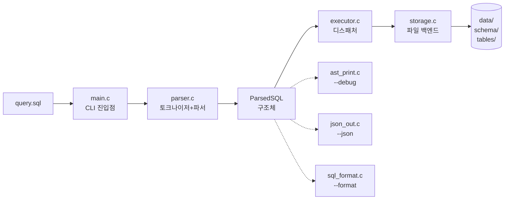
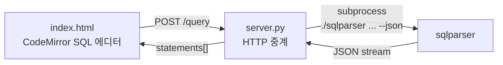
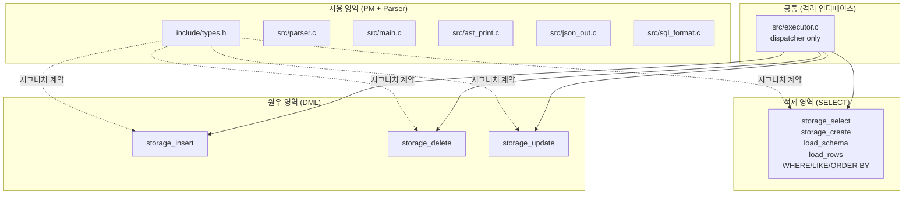
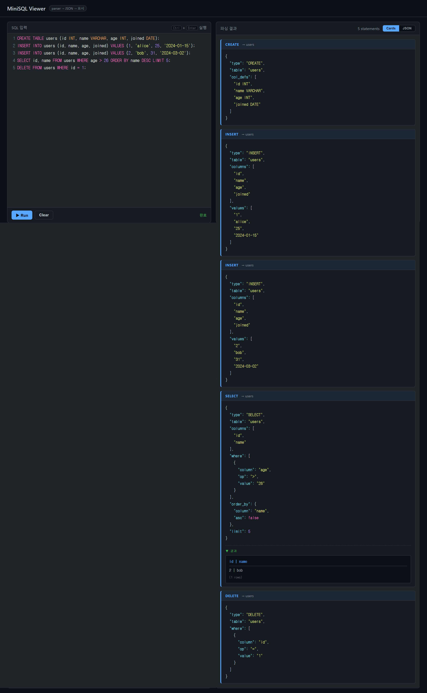
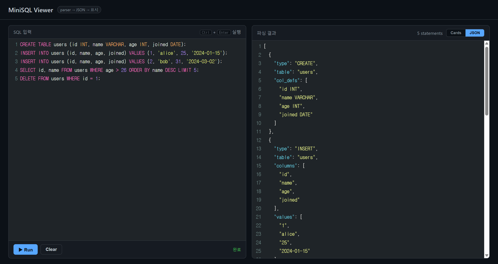

# MiniSQL — 파일 기반 SQL 처리기

```
                                                              ,,,
                                                     ,*==;      :=#@#;
                                                    :#=**#$, .:#@@$=#@:
                              ..                   :@;.  ,$$~$@@=-. -#$.
                            ~#@@#=;-.           ..-#!     ,$@@=,     *@-
                           -@@##@@@@#=,   ,;*==$$##$.      ~@;       -@*
                           =@:   .:=#@@$=@@@@@@###@~        =!        @#
                          ,#$       .~#@@@=;--,,.;$.   ,!=;.*@:.      $@.
                          ~@:          -,        ==   ,$#$@@@###=..,~!@@:,
                          ;@                     $;   ~@--@$~,.-$$$#$*!*$$-
                          =@                    ,#-   ;#.*#-    ,$#,    .==     :::       ::: :::::::::: :::         ::::::::   ::::::::  ::::    ::::  :::::::::: 
                          $#                    ,@,   -@=#=      *#:.    !$.    :+:       :+: :+:        :+:        :+:    :+: :+:    :+: +:+:+: :+:+:+ :+:        
                          *@                    .#~   .!#@!      ;@@#-   ;$.    +:+       +:+ +:+        +:+        +:+        +:+    +:+ +:+ +:+:+ +:+ +:+        
                          :@.                    =!     -#=      !#:#*   *=     +#+  +:+  +#+ +#++:++#   +#+        +#+        +#+    +:+ +#+  +:+  +#+ +#++:++#   
                          -@=;.                  :#:. ..-$#,    ,$$.==  .=*     +#+ +#+#+ +#+ +#+        +#+        +#+        +#+    +#+ +#+       +#+ +#+        
                          .#@@.                   ;@$==$#=$$-  ,=@#$@:  ,#~      #+#+# #+#+#  #+#        #+#        #+#    #+# #+#    #+# #+#       #+# #+#        
                           =@;                     -*==!, ,=###@@*=$!.  ;#         ###   ###   ########## ##########  ########   ########  ###       ### ########## 
                          .$$.                              ,~~~@- .   ~@:
                          -@!                                   !$,   -#@:
                          *@                                    .=#!:!#$@$
                         .@=                                      ;=$=! =@.
                         :@~                                        .   :@:
                         *@,                                            -@*       ::::::::   ::::::::   :::         :::::::::      :::     :::::::::   ::::::::  :::::::::: :::::::::  
                         =#,                                            -@#====! :+:    :+: :+:    :+:  :+:         :+:    :+:   :+: :+:   :+:    :+: :+:    :+: :+:        :+:    :+: 
                         $#.                                          ;#@@@$===*.+:+        +:+    +:+  +:+         +:+    +:+  +:+   +:+  +:+    +:+ +:+        +:+        +:+    +:+ 
                        .$$.                                         .;-~#$      +#++:++#++ +#+    +:+  +#+         +#++:++#+  +#++:++#++: +#++:++#:  +#++:++#++ +#++:++#   +#++:++#:  
                        .$$.                                 ;$,        .$=             +#+ +#+  # +#+  +#+         +#+        +#+     +#+ +#+    +#+        +#+ +#+        +#+    +#+ 
                     ,;*=@@$=*.     .*;                     -@@$        .#=      #+#    #+# #+#   +#+   #+#         #+#        #+#     #+# #+#    #+# #+#    #+# #+#        #+#    #+# 
                    =@#$$#@$==.     =@@-                    ~@@@       .~@=,.     ########   ###### ### ##########  ###        ###     ### ###    ###  ########  ########## ###    ### 
                    --,. !@-        @@@~                    -@@$      .$@@@#$=;
                         ,@;        #@@~          .          ;=,        !@*:;!:
                          ##        -#=.        -=$$;                   $@.
                         .*@=$!                 @: ,#,                 ,@!
                       .!$@@@:.                 #- .#,               ;;$@-
                       *$!:=@~                  :=$=;                *@@@$~.
                       ..  .##.                   .                  .@@*#@$!
                            -@$!@=                                  .=@;  ~=$~
                            ,#@@=.                                 ~$@:     .
                           ~@#=#@;.                              .:@#:
                         .=@!. ,*@#;                           .!#@#-
                         *#~     :$@@:,                    .,~=@@#!
                         ,.       .:#@@$=!-.          .,:*=$@@@$~.
                                     -*$#@@@@@@####@@@@@@@#$=;.
                                        ,-~:!*=$####$=!:--,

Hello Kitty welcomes you to MiniSQL!
```

> **정글 6주차 1일 프로젝트** · C 로 만든 미니 DBMS
> CREATE / INSERT / SELECT / UPDATE / DELETE 를 직접 파싱·실행하고,
> Python 서버 + HTML 뷰어까지 한 번에 묶었다.

[]() []() []() []()

---

## ⚡ 한 줄 데모

```bash
./run_demo.sh
```

빌드 → 단위 테스트 → CLI 시연 → HTTP 서버 시작 → 브라우저 안내까지 한 방에.

---

## 📦 빠른 시작

```bash
make                     # 빌드
make test                # 227 단위 테스트
./sqlparser query.sql    # CLI 실행
python3 server.py        # 브라우저 뷰어 (http://localhost:8000)
```

---

## 🎯 지원 SQL

| 구문 | 예시 |
|---|---|
| `CREATE TABLE` | `CREATE TABLE users (id INT, name VARCHAR, joined DATE);` |
| `INSERT` | `INSERT INTO users (id, name) VALUES (1, 'alice');` |
| `SELECT` | `SELECT id, name FROM users WHERE age > 20 ORDER BY name DESC LIMIT 5;` |
| `UPDATE` | `UPDATE users SET age = 26 WHERE id = 1;` |
| `DELETE` | `DELETE FROM users WHERE id = 2;` |
| **N-ary WHERE** | `SELECT * FROM users WHERE age > 24 AND city = 'Seoul' AND age < 32;` |
| **혼합 결합** | `DELETE FROM users WHERE city = 'Busan' OR age < 25 AND id > 1;` |
| **집계 함수 5종** | `SELECT COUNT(*) FROM users;` `SELECT SUM(age) FROM users;` `SELECT AVG(price) FROM orders;` `SELECT MIN(joined) FROM users;` `SELECT MAX(name) FROM users;` |
| 패턴 매칭 | `SELECT * FROM users WHERE name LIKE 'A%';` |
| 라인 주석 | `-- 이건 무시됨` |

**컬럼 타입 6종:** `INT`, `VARCHAR`, `FLOAT`, `BOOLEAN`, `DATE` (`'YYYY-MM-DD'`), `DATETIME`

**WHERE 연산자:** `=`, `!=`, `>`, `<`, `>=`, `<=`, `LIKE` (`%`, `_`)
**N개 조건** + `AND` / `OR` 자유 혼합 결합 (왼→오 평가, 그룹화는 미지원).

---

## 🛠 CLI 플래그

| 플래그 | 동작 |
|---|---|
| (없음) | 파싱 → 실행 |
| `--debug` | AST 트리 출력 |
| `--json` | ParsedSQL JSON 직렬화 |
| `--tokens` | 토크나이저 출력만 |
| `--format` | ParsedSQL → 정규화 SQL 재출력 (round-trip) |
| `--help`, `-h` | 사용법 |
| `--version` | 버전 |

`--debug`, `--json`, `--format` 동시 사용 가능.

---

## 🏗 아키텍처

### 데이터 흐름



### 브라우저 데모 경로



### 부품별 책임

| 파일 | 책임 |
|---|---|
| `src/parser.c` | 토크나이저 + 재귀 하강 파서 → `ParsedSQL*` 반환 |
| `src/executor.c` | `ParsedSQL` 디스패처. 쿼리 종류별 storage 호출 |
| `src/storage.c` | 파일 기반 백엔드 (CSV + .schema 텍스트) |
| `src/ast_print.c` | `--debug` AST 트리 시각화 |
| `src/json_out.c` | `--json` JSON 직렬화 |
| `src/sql_format.c` | `--format` 정규화 SQL 재직렬화 |
| `src/main.c` | CLI 진입점, 옵션 처리, 세미콜론 split, JSON 격리 |
| `include/types.h` | `ParsedSQL`, `ColumnType`, 모든 함수 선언 (인터페이스 계약) |
| `server.py` | Python stdlib HTTP 중계 (의존성 0) |
| `index.html` | 단일 페이지 SQL 뷰어, CodeMirror 신택스 하이라이트, Cards/JSON 토글 |

### 인터페이스 계약 (storage.c)

`include/types.h` 의 `storage_*` 함수 시그니처는 **절대 변경 금지** (의도된 갱신 외).
호출부 (`executor.c`) 는 storage 의 내부 구조를 알면 안 된다 (캡슐화).
이 원칙 덕분에 1차 완성 후 후속 작업에서 시그니처를 안전하게 갱신할 수 있었다 ([아래](#-하루-안에--1차-완성--후속-리팩토링) 참고).

---

## 📁 디렉토리 구조

```
sql_parser/
├── include/
│   └── types.h              ─── 모든 자료구조 + 함수 선언 (인터페이스)
├── src/
│   ├── main.c               ─── CLI 진입점, --json/--debug/--tokens/--format
│   ├── parser.c             ─── 토크나이저 + 파서 (지용)
│   ├── ast_print.c          ─── --debug 트리 (지용)
│   ├── json_out.c           ─── --json 직렬화 (지용)
│   ├── sql_format.c         ─── --format 재직렬화 (지용)
│   ├── executor.c           ─── ParsedSQL 디스패처
│   └── storage.c            ─── 파일 기반 백엔드 (석제 SELECT/CREATE + 원우 INSERT/DELETE/UPDATE)
├── tests/
│   ├── test_parser.c        ─── 150 단위 테스트 (parser/AST/JSON/format)
│   ├── test_executor.c      ─── 3 executor 통합 테스트
│   ├── test_storage_insert.c ── 10 INSERT 단위 테스트
│   ├── test_storage_delete.c ── 18 DELETE 단위 테스트
│   └── test_storage_update.c ── 20 UPDATE 단위 테스트
├── data/                    ─── (gitignored) 런타임 schema/, tables/
├── docs/
│   ├── QA_CHECKLIST.md      ─── 60+ 수동 회귀 케이스
│   └── QA_REPORT_AUTO.md    ─── 자동 검증 보고서
├── server.py                ─── Python HTTP 중계 서버
├── index.html               ─── 다크 테마 + CodeMirror 뷰어
├── query.sql                ─── 발표 데모 시나리오
├── run_demo.sh              ─── 빌드+테스트+CLI+서버 부트스트랩
├── .github/
│   ├── workflows/build.yml  ─── CI: build + test + valgrind
│   └── pull_request_template.md
├── Makefile
├── CLAUDE.md / agent.md     ─── PM 컨텍스트 / 팀원 가이드
└── README.md
```

---

## ✅ 품질 지표

| 항목 | 값 |
|---|---|
| 단위 테스트 | **227 passed / 0 failed** (1차 201 + 후속 +26) |
| 빌드 경고 | **0** (`-Wall -Wextra -Wpedantic`) |
| Valgrind 누수 | **0** (sqlparser + test_runner + test_storage_* 5 바이너리) |
| GitHub Actions CI | ✅ 모든 push/PR (main/dev/dev2) 자동 검증 |
| 자동 QA 케이스 | **47 / 47 통과** ([QA_REPORT_AUTO.md](docs/QA_REPORT_AUTO.md)) |

### 테스트 커버리지

- 5 종 쿼리 (CREATE/INSERT/SELECT/DELETE/UPDATE)
- 6 종 ColumnType (INT/VARCHAR/FLOAT/BOOLEAN/DATE/DATETIME)
- WHERE 6 연산자 + N-ary AND/OR 혼합 결합 + LIKE 패턴
- ORDER BY ASC/DESC, LIMIT (0, 음수, 초과 모두)
- 집계 함수 5종 (COUNT/SUM/AVG/MIN/MAX), 타입 검증, 빈 결과, 1000건 처리
- AST/JSON/format 출력 round-trip 검증
- 토크나이저 엣지 (음수, float, 따옴표, DATE, 빈 따옴표, 라인 주석)
- RowSet API 직접 검증 (in-memory 결과)

---

## 📈 하루 안에 — 1차 완성 → 후속 리팩토링

이 프로젝트는 **하루 만에** 두 단계로 만들어졌다.
오전에 1차 완성을 끝낸 다음, 사용/리뷰 과정에서 발견한 한계를
오후에 같은 팀이 후속 리팩토링으로 정리.

### 🅰 1차 완성 (오전 ~ 점심)

**니즈:** "4 분 발표를 위해 5 종 SQL 을 안전하게 파싱·실행하고, CLI / 브라우저 양쪽에서 시연 가능한 결과물."

**구현 결과:**
- `parser.c` — 토크나이저 + 재귀 하강 파서, 5 종 쿼리, COUNT(*), LIKE
- `storage.c` — 파일 기반 백엔드 (CSV + .schema)
- `executor.c` — `ParsedSQL` 디스패처
- CLI 6 플래그 (`--debug` / `--json` / `--tokens` / `--format` / `--help` / `--version`)
- `server.py` (Python stdlib) + `index.html` (CodeMirror, Cards/JSON 토글, 다크 테마)
- GitHub Actions CI + PR 템플릿 + 브랜치 보호
- **201 단위 테스트, valgrind 누수 0**
- 발표 안정 상태로 `main` 머지 완료

### 🅱 사용/리뷰에서 발견된 한계

1차 완성 후 코드를 들여다보면서 드러난 약점:

| 발견 | 원인 |
|---|---|
| **`storage_select` 가 결과를 stdout 에만 print** | 다른 함수가 결과를 받아 쓸 수 없음 → JOIN/집계/subquery 모두 불가능 |
| **WHERE 가 1~2 조건 + 단일 결합자만** | `WHERE a=1 AND b=2 AND c=3` 같은 N개 조건 미지원 |
| **`storage_delete` / `storage_update` 시그니처 불일치** | SELECT 는 `ParsedSQL*` 받는데, DELETE/UPDATE 는 `WhereClause*` + count 따로 받음 → API 비대칭 + N-ary 결합자 전달 불가 |
| **집계 함수가 COUNT(*) 한 종류만** | SUM/AVG/MIN/MAX 미지원 |
| **silent error 다수** | "존재하지 않는 테이블 SELECT" 등이 에러 메시지 없이 빈 결과 |
| **server.py 가 `--json` 출력에서 `{"raw": ...}` 객체 다수** | storage 가 `--json` 모드에서도 표를 stdout 에 같이 찍어 JSON stream 오염 |

### 🅲 후속 리팩토링 (점심 ~ 오후)

같은 팀 3 명이 영역을 나눠서 한 번 더 작업.
**1차 완성을 보존**하기 위해 새 통합 브랜치 `dev2` 에서 진행 (main 은 발표용 안정 상태 그대로).

| # | 작업 | 담당 | 핵심 변경 |
|---|---|---|---|
| **MP1** | 인터페이스 계약 갱신 | 지용 | `RowSet` 구조체 + `where_links` 배열 + 새 함수 선언 (`storage_select_result` / `print_rowset` / `rowset_free`) |
| **A** | RowSet 인프라 + 집계 함수 5종 | 지용 | `storage_select_result()` 가 결과를 메모리 RowSet 으로 반환. SUM/AVG/MIN/MAX 신설. `storage_select` 는 얇은 wrapper 로. silent error 6곳에 친절 메시지 |
| **B** | Parser N-ary WHERE + stop set | 석제 | `parse_where` 가 N개 조건 + 결합자 배열 (`where_links`) 지원. `parse_select` 에 stop set (`)`, `;` 등) 도입 — 미래 subquery/괄호 대비 |
| **C** | UPDATE/DELETE 시그니처 통일 | 원우 | `storage_delete(table, ParsedSQL*)` / `storage_update(table, ParsedSQL*)` 로 SELECT 와 동일 패턴. 본문에서 N-ary 결합자 평가 |

### 추가/변경 요약

**새 인터페이스:**
```c
/* Phase 1 신설 */
typedef struct {
    int     row_count;
    int     col_count;
    char  **col_names;
    char ***rows;
} RowSet;

int  storage_select_result(const char *table, ParsedSQL *sql, RowSet **out);
void print_rowset(FILE *out, const RowSet *rs);
void rowset_free(RowSet *rs);

/* 시그니처 통일 (1주차 → 후속) */
int storage_delete(const char *table, ParsedSQL *sql);
int storage_update(const char *table, ParsedSQL *sql);

/* ParsedSQL 확장 */
char **where_links;   /* N-1 개 결합자 ("AND"/"OR"), 1주차 호환 fallback 유지 */
```

**새 SQL:**
```sql
-- 집계 함수 5종 (1주차에는 COUNT(*) 만)
SELECT SUM(age)  FROM users;
SELECT AVG(price) FROM orders;
SELECT MIN(joined) FROM users;
SELECT MAX(name)  FROM users;

-- N-ary WHERE (1주차에는 1~2 조건만)
SELECT * FROM users WHERE age > 24 AND city = 'Seoul' AND age < 32;
DELETE FROM users WHERE city = 'Busan' OR age < 25 AND id > 1;
UPDATE users SET city = 'Jeju' WHERE age > 30 AND name = 'bob';
```

**친절한 에러 메시지 (silent error → stderr):**
- 존재하지 않는 테이블 / SELECT 컬럼 / WHERE 컬럼
- 빈 테이블에서도 WHERE 컬럼 오타 사전 검증
- SUM/AVG 타입 mismatch / 집계 컬럼 없음

### 변화의 핵심 가치

**데이터 / 표시 분리.** 1주차의 storage 는 결과를 화면에 출력만 하는 "프린터"였다.
후속 리팩토링으로 **데이터 반환 함수**가 생기면서, 향후 JOIN / 집계 GROUP BY / subquery 모든 길이 열렸다.

**인터페이스 일관성.** SELECT / DELETE / UPDATE 모두 `ParsedSQL*` 한 인자로 통일.
호출부가 깔끔해지고, N-ary 결합자 같은 새 필드가 자연스럽게 흘러간다.

**1주차 호환 0 회귀.** 후속 리팩토링 후에도 1주차 단위 테스트 (201개) 가 모두 통과.
시그니처가 바뀐 두 함수만 호출 인자 갱신, 본문 동작은 동일.

### 결과

| 지표 | 1차 완성 | 후속 리팩토링 후 |
|---|---|---|
| 단위 테스트 | 201 | **227** (+30 RowSet/집계, +나머지) |
| 빌드 경고 | 0 | **0** |
| valgrind 누수 | 0 | **0** (5 바이너리 모두) |
| storage 함수 | 5 | **8** (+ 3 RowSet 신설) |
| WHERE 조건 수 | 최대 2 | **N개** (혼합 결합) |
| 집계 함수 | 1 (COUNT) | **5** (COUNT/SUM/AVG/MIN/MAX) |
| 에러 메시지 친절도 | 부분적 | **대부분 케이스 stderr** |

---

## 🎤 발표 포인트 — N-ary WHERE 리팩토링 Before / After

후속 리팩토링에서 가장 임팩트가 컸던 변화를 코드 레벨로 펼쳐본다.
**1주차의 가장 큰 약점:** WHERE 가 최대 2 조건까지밖에 못 받았다.

### 1. 같은 의도, 다른 결과 — 쿼리로 보기

```sql
-- ❌ 1주차 (최대 2 조건만 — 3번째부터 무시되거나 파싱 실패)
SELECT * FROM users WHERE age > 24 AND city = 'Seoul';

-- ✅ 후속 리팩토링 (N개 조건, AND/OR 자유 혼합)
SELECT * FROM users WHERE age > 24 AND city = 'Seoul' AND age < 32 OR name = 'bob';
```

### 2. 왜 2개까지밖에 안 됐는가 — 1주차 코드

`ParsedSQL` 안에 결합자가 **고정 길이 문자열 한 칸** 이었고,
`parse_where` 가 아예 **2칸짜리 배열을 미리 잡아놓고 for(i<2) 하드코딩** 으로 돌고 있었다.

```c
/* 리팩토링 전 — include/types.h (ParsedSQL 일부) */
WhereClause *where;
int          where_count;    /* 0~2 */
char         where_logic[8]; /* "AND" 또는 "OR" — 단 하나만 */

/* 리팩토링 전 — src/parser.c parse_where */
static void parse_where(TokenList *t, ParsedSQL *sql) {
    sql->where = calloc(2, sizeof(WhereClause));   /* 최대 2칸 미리 잡기 */
    sql->where_count = 0;

    for (int i = 0; i < 2; i++) {                  /* 하드코딩된 2회 루프 */
        const char *col = advance(t);
        const char *op  = advance(t);
        /* ... */
    }
}

/* 리팩토링 전 — DELETE/UPDATE 가드도 "0 또는 1 조건" 만 통과 */
if (where_count == 0) {
    return 0;
}
if (where_count != 1 || where == NULL) {
    return -1;
}
```

핵심 한계 3가지:
- `where_logic[8]` — **결합자가 한 개만** → `A AND B AND C` 의 두 결합자를 표현 못 함
- `calloc(2, ...)` + `for(i<2)` — **2칸 하드코딩** → 3번째 조건을 받을 칸이 없음
- DML 가드가 `where_count != 1` — **DELETE/UPDATE 는 단일 조건만 허용**

### 3. 어떻게 풀었는가 — 이중 포인터 + N-1 결합자 배열

```c
/* 리팩토링 후 — include/types.h (ParsedSQL 일부) */
WhereClause *where;
int          where_count;
char       **where_links;   /* ⭐ 이중 포인터 — N-1 개 결합자 ("AND"/"OR") */
```

핵심 아이디어:
- `where` 는 그대로 N개 동적 확장 가능한 배열
- `where_links` 는 **`char **`** — 결합자를 N-1개 저장하는 가변 길이 문자열 배열
- N개 조건 사이에 N-1개 결합자가 들어간다 (`A [link0] B [link1] C [link2] D ...`)
- 1주차 호환을 위해 `where_logic[8]` 도 일단 fallback 으로 유지 → **회귀 0**

```c
/* 리팩토링 후 — src/parser.c parse_where (개념 발췌) */
static void parse_where(TokenList *t, ParsedSQL *sql) {
    sql->where       = NULL;
    sql->where_links = NULL;
    sql->where_count = 0;

    while (!at_stop(t)) {                           /* 하드코딩 2회 → N회 */
        sql->where = realloc(sql->where,
                             sizeof(WhereClause) * (sql->where_count + 1));
        /* ... col / op / value 파싱 ... */
        sql->where_count++;

        const char *link = peek(t);
        if (eq_ci(link, "AND") || eq_ci(link, "OR")) {
            sql->where_links = realloc(sql->where_links,
                                       sizeof(char*) * sql->where_count);
            sql->where_links[sql->where_count - 1] = strdup(advance(t));
        } else {
            break;
        }
    }
}

/* 리팩토링 후 — DELETE/UPDATE 가드는 "조건 수 제한" 자체가 사라짐 */
if (where_count == 0) {
    return 0;          /* 전체 매칭은 그대로 */
}
/* where_count != 1 가드 삭제 — N개 조건 모두 평가 */
```

### 4. 시그니처 통일 — 부수적이지만 본질적

N-ary WHERE 의 결합자 배열을 DELETE/UPDATE 본문까지 흘려주려면
`WhereClause *` + `int` 두 인자만으로는 부족했다. SELECT 와 동일한 패턴으로 통일.

```c
/* Before — 1주차 */
int storage_delete(const char *table, WhereClause *where, int where_count);
int storage_update(const char *table, SetClause *set, int set_count,
                   WhereClause *where, int where_count);

/* After — 후속 리팩토링 */
int storage_delete(const char *table, ParsedSQL *sql);
int storage_update(const char *table, ParsedSQL *sql);
```

호출부 (`executor.c`) 도 한 줄씩만 갱신:

```c
/* Before */
storage_delete(sql->table, sql->where, sql->where_count);

/* After */
storage_delete(sql->table, sql);
```

### 5. 결과

| 항목 | 1주차 | 후속 리팩토링 후 |
|---|---|---|
| WHERE 조건 수 | 최대 **2** | **N개** (배열 동적 확장) |
| 결합자 표현 | `char where_logic[8]` (1개) | `char **where_links` (N-1개) |
| DML 가드 | `where_count != 1` 차단 | 제한 없음 — N개 평가 |
| `storage_delete/update` 시그니처 | 4-5 인자 | `ParsedSQL*` 한 인자 |
| 단위 테스트 | 201 | **227** (+30 N-ary/RowSet/집계) |

### 6. 관련 PR — 점수 + 책임 소재

PR 은 단순한 코드 묶음이 아니라 **누가 / 어디까지 / 왜** 를 동시에 기록한다.
이 리팩토링과 그 기반이 된 1주차 SELECT 영역을 같이 보면 책임 소재가 한눈에 잡힌다.

| PR | 담당 | 단계 | 점수 / 핵심 |
|---|---|---|---|
| [JYPark-Code/jungle_w6_mini_mysql_sql_parser#18](https://github.com/JYPark-Code/jungle_w6_mini_mysql_sql_parser/pull/18) | 석제 | 1주차 | **A** — SELECT 영역 1차 완성 (`storage_select` / `storage_create` / CSV 파서 / WHERE / LIKE / ORDER BY). 인터페이스 계약 위반 0, 후속 N-ary 평가의 토대 |
| [JYPark-Code/jungle_w6_mini_mysql_sql_parser#32](https://github.com/JYPark-Code/jungle_w6_mini_mysql_sql_parser/pull/32) | 원우 | 후속 | **A** — UPDATE/DELETE 시그니처 통일 + N-ary WHERE 평가 (`json_out` / `sql_format` 채택) |
| [JYPark-Code/jungle_w6_mini_mysql_sql_parser#33](https://github.com/JYPark-Code/jungle_w6_mini_mysql_sql_parser/pull/33) | 석제 | 후속 | **A** — Parser stop set + N-ary `parse_where` (`parse_where` / `parse_select` / `ast_print` 채택) |

PR #32 와 #33 의 충돌 함수는 옆으로 비교 → **함수마다 더 나은 쪽** 을 골라 통합 ([아래 옵션 B 사례](#후속-리팩토링--옵션-b-mixed-merge-사례-) 참고).
PR #18 은 1주차 SELECT 의 책임 소재가 석제임을 영구히 기록 — 후속 단계에서 같은 영역을 N-ary 로 확장할 때도 누구에게 리뷰를 청할지 자명했다.

---

# 🤝 협업 모델

이 1주차 결과물은 4명이 **각자 영역을 격리한 상태에서 병렬 개발** 하고,
**GitHub Actions CI 가 모든 PR 을 자동 검증**, PM 이 코드 리뷰 후 머지하는 워크플로로 만들어졌다.

## GitHub Actions CI

`.github/workflows/build.yml` 가 모든 push/PR 에 자동으로:

```yaml
- gcc/make/valgrind 설치
- make CFLAGS="-Werror"           # 경고도 빌드 실패 처리
- make test                        # 단위 테스트 (227)
- valgrind --leak-check=full ./test_runner
- valgrind --leak-check=full ./sqlparser query.sql
```

→ PR 페이지에 빨간/초록 자동 표시.
**1차 완성** 의 B vs C 경쟁 평가 객관화 + **후속 리팩토링** 의 회귀 검증 모두 결정적.
(후속 작업 시작 시 dev2 trigger 누락을 발견해 한 줄 fix 했다.)

## 병렬 개발 — 영역 격리



**핵심 원칙:**
- `include/types.h` 의 `storage_*` 시그니처는 **절대 변경 금지** → 인터페이스 계약
- 각자 자기 함수 본문만 채움 → 동시 작업 시 머지 충돌 최소화
- `executor.c` 는 dispatcher 만 — 어느 한 명이 망쳐도 다른 사람은 작업 가능

## 머지 워크플로

```
feature/<본인>  →  PR + CI green  →  PM 리뷰  →  dev  →  PR  →  main
```

- **`main` / `dev`** 는 브랜치 보호 (직접 push 차단, admin 만 우회)
- 모든 PR 은 `.github/pull_request_template.md` 양식 자동 적용
- 모든 PR 은 CI 자동 검증 + PM 코드 리뷰 후 머지

## 1차 완성 — 석제 · 원우 PR 결과

두 분이 storage 영역을 나눠서 구현했고, 모두 인터페이스 계약을 지키며 성공적으로 머지됐습니다.

### 석제 — SELECT 영역 (PR #18, #22)

| 항목 | 결과 |
|---|---|
| 담당 | `storage_select`, `storage_create`, CSV 파서, WHERE/LIKE/ORDER BY |
| 단위 테스트 | 3 (executor 통합 테스트) |
| 핵심 구현 | RFC 4180 호환 CSV 파서, LIKE 패턴 매칭 (`%`, `_`), 타입별 비교 |
| 부가 작업 | `.gitattributes` LF 통일, 크로스 플랫폼 mkdir |
| 인터페이스 계약 | ✅ types.h/parser.c/main.c 변경 0 |

### 원우 — INSERT/DELETE/UPDATE 영역 (PR #23)

| 항목 | 결과 |
|---|---|
| 담당 | `storage_insert`, `storage_delete`, `storage_update` + 헬퍼 |
| 단위 테스트 | **48** (insert 10 + delete 18 + update 20) |
| 핵심 구현 | 타입 검증, NULL 가드 145곳, CSV 이스케이프 |
| 부가 작업 | Makefile 에 새 테스트 빌드 룰 통합 |
| 인터페이스 계약 | ✅ types.h/parser.c/main.c/executor.c 변경 0 |

두 PR 모두 GitHub Actions CI 자동 검증 + 코드 리뷰 + valgrind 누수 0 을 통과한 뒤 머지되었습니다.

## 후속 리팩토링 — 옵션 B Mixed Merge 사례 ⭐

후속 작업 (`dev2`) 에서 두 명이 같은 영역을 동시에 작업한 케이스가 있었다.
원우님이 N-ary WHERE 평가를 검증하기 위해 parser 까지 만들었고, 그 사이 석제님도
같은 parser N-ary 를 본인 영역에서 작업.

**평범한 머지 패턴 (한 명만 채택)** 대신 **함수 단위 비교 후 베스트 통합** 을 시도:

```
원우 PR #32 머지 → dev2 에 원우 N-ary 구현
       ↓
석제 PR #33 들어옴 → CONFLICT 5 곳 (parser/ast/json/format/test)
       ↓
함수별로 두 구현 옆으로 비교:
  parse_where:        석제 (단일 while, 결합자 정규화, 깔끔)
  parse_select stop:  석제 (신규 기능, 원우 없음)
  ast_print:          석제 (inline 결합자 직관적)
  json_out:           원우 (emit_str_array 헬퍼 재사용)
  sql_format:         원우 (NULL 안 반환, robust)
  test_parser.c:      두 사람 케이스 합집합
       ↓
mixed merge commit (양쪽 Co-Authored-By)
       ↓
PR #33 머지
```

이 패턴의 가치:
- **두 사람 작업 모두 살아남음** — 1주차 PR #20 vs #21 처럼 "한 명 채택, 한 명 탈락" 이 아님
- **결과 코드 품질 ↑** — 각 함수마다 더 나은 쪽 채택
- **학습 효과** — 두 구현을 옆으로 비교하면서 패턴 학습

## 합산 통계

| 항목 | 1차 완성 | 후속 리팩토링 후 |
|---|---|---|
| Pull Request 수 | 24 | **34** (+10) |
| 머지된 commit | 60+ | **80+** |
| C 소스 라인 | ~5000 | **~6500** |
| 단위 테스트 | 201 | **227** |
| CI 실행 시간 | 25 초 | **30 초** |
| Valgrind 누수 | 0 | **0** |
| 작업자 | 4 명 | 3 명 (1차 완성 + 후속) |
| 작업 기간 | 약 7 시간 | **+ 약 4 시간 (같은 날)** |

---

## 🎬 발표 데모 흐름

```bash
./run_demo.sh
```

1. `make` 빌드 (무경고)
2. `make test` — 227 통과
3. `./sqlparser query.sql --debug` — AST 트리 + 실행 결과
4. `python3 server.py` — 브라우저에서 `http://localhost:8000`

### 시연 SQL (`query.sql`)

```sql
CREATE TABLE users (id INT, name VARCHAR, age INT, joined DATE);

INSERT INTO users (id, name, age, joined) VALUES (1, 'alice', 25, '2024-01-15');
INSERT INTO users (id, name, age, joined) VALUES (2, 'bob',   31, '2024-03-02');
INSERT INTO users (id, name, age, joined) VALUES (3, 'carol', 28, '2024-06-20');

SELECT * FROM users;

SELECT id, name FROM users WHERE age > 26 ORDER BY age DESC LIMIT 2;

UPDATE users SET age = 26 WHERE name = 'alice';

DELETE FROM users WHERE id = 2;

SELECT * FROM users;

SELECT COUNT(*) FROM users;
```

### 브라우저 뷰어 기능

- **CodeMirror SQL 에디터** — 신택스 하이라이트, 줄 번호, `Ctrl+Enter` 실행
- **Cards / JSON 토글** — 결과를 statement 별 카드 또는 통합 JSON 으로
- **다크 테마 (Dracula)**
- **stderr 분리 표시** — 에러 메시지는 별도 영역

#### 스크린샷




