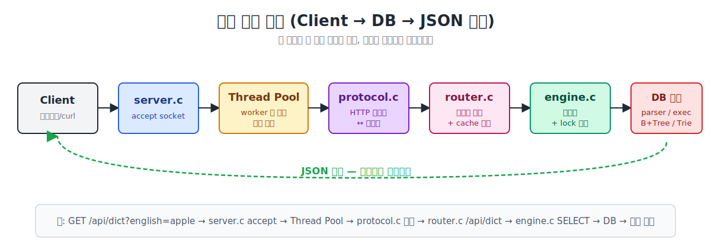
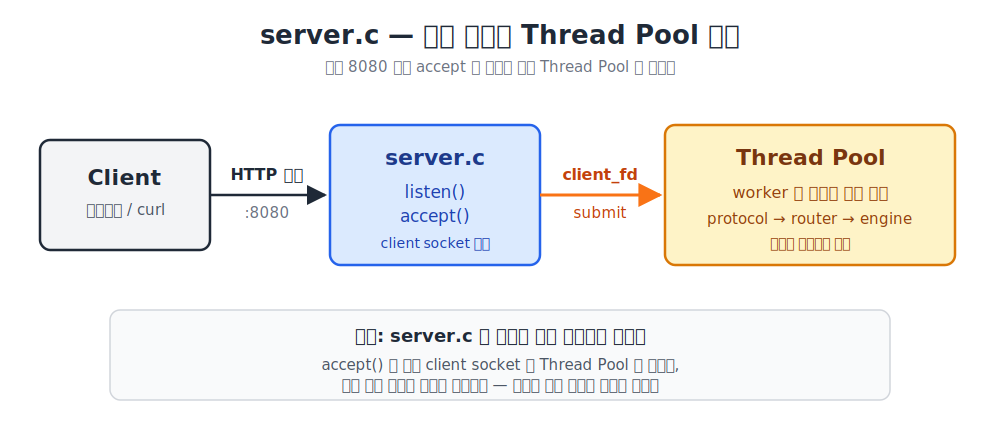
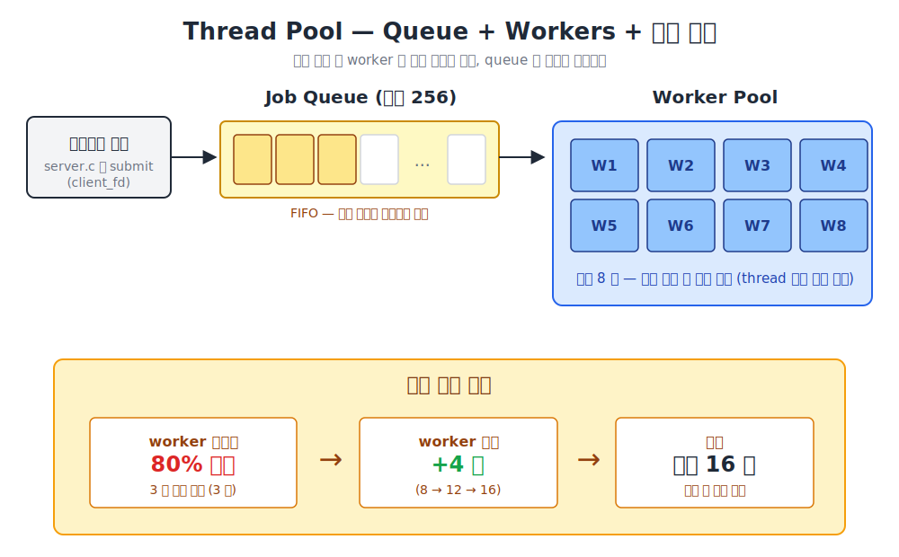
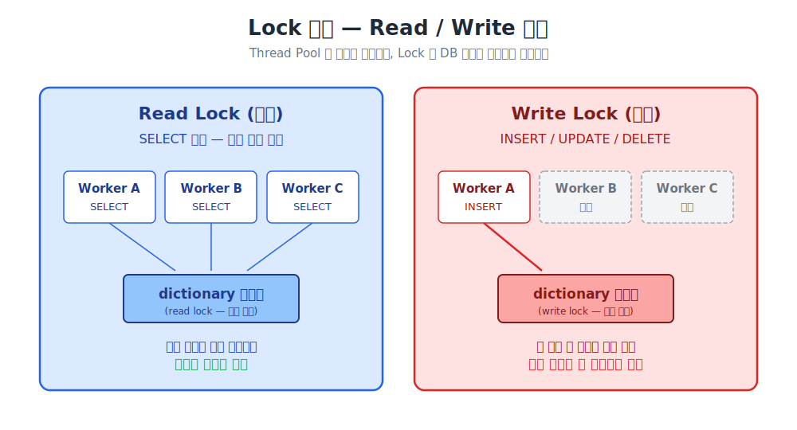
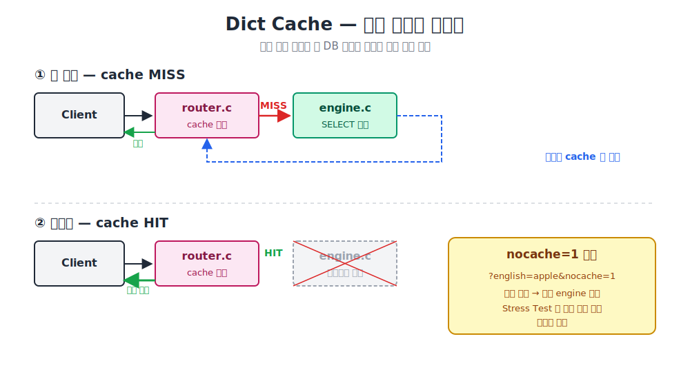
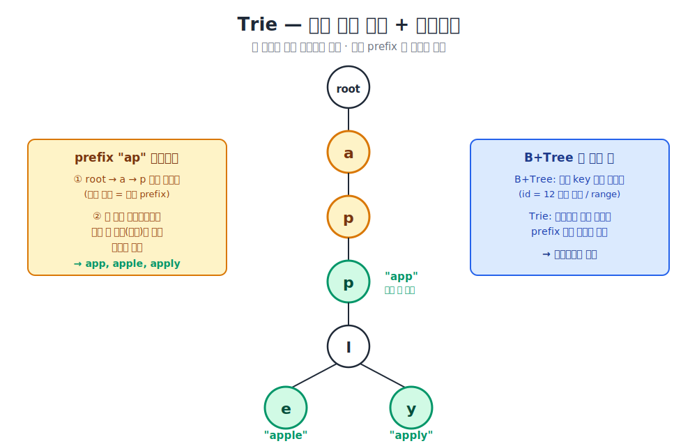
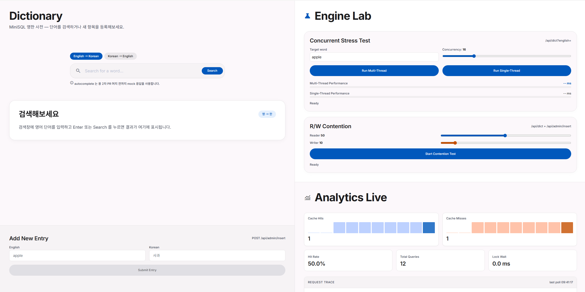

# MiniSQL Dictionary Lab

## 1. 프로젝트 전체 흐름

이번 프로젝트는 기존에 구현했던 MiniSQL DB 엔진을 API 서버 형태로 확장한 프로젝트입니다.

기존에는 CLI에서 SQL을 직접 실행하는 구조였다면, 이번에는 브라우저나 외부 클라이언트가 HTTP 요청을 보내고, 서버가 그 요청을 내부 DB 엔진으로 연결해 실행하는 구조입니다.

전체 요청 흐름은 크게 이렇게 볼 수 있습니다.

```text
Client
-> server.c
-> Thread Pool
-> protocol.c
-> router.c
-> engine.c
-> 기존 DB 엔진
-> JSON 응답
-> Client
```


간단히 말하면, 서버가 요청을 받고, Thread Pool이 병렬적으로 요청 처리를 맡고, protocol과 router를 거쳐 engine으로 들어간 뒤, 기존 DB 엔진을 실행하고 결과를 다시 HTTP 응답으로 돌려주는 구조입니다.

## 2. server.c - 서버의 입구

먼저 MiniSQL Dictionary Lab 서버의 입구 역할을 만들었습니다.

서버가 실행되면 지정된 포트에서 클라이언트 접속을 기다립니다. 기본 포트는 `8080`입니다.

클라이언트가 접속하면 소켓을 통해 HTTP 요청을 받습니다.

다만 요청을 바로 처리하는 것은 아닙니다.

접속된 client socket을 Thread Pool에 작업으로 넘기고, 실제 요청 처리는 worker thread가 담당하게 합니다.

요청 처리가 끝나면 응답을 다시 소켓으로 보내고 연결을 닫습니다.



## 3. Thread Pool - 동시 요청 처리

이번 과제의 중요한 요구사항 중 하나가 Thread Pool을 사용해서 SQL 요청을 병렬로 처리하는 것이었습니다.

요청이 들어올 때마다 thread를 새로 만들면 생성 비용이 크기 때문에, 서버가 실행될 때 worker thread를 미리 만들어 둡니다.

현재 구조에서는 기본적으로 worker thread 8개를 생성합니다.

그리고 요청이 대기할 queue는 최대 256개로 제한합니다.

요청이 들어오면 그 요청을 queue에 넣고, 대기 중인 worker가 queue에서 작업을 꺼내 처리합니다.

요청이 많아져서 worker의 80% 이상이 3초 정도 계속 작업 중이면 worker를 4개씩 늘립니다.

자동 확장은 최대 16개까지 가능합니다.

다만 worker가 많다고 해서 DB 작업이 무조건 전부 동시에 실행되는 것은 아닙니다.

DB 내부에는 CSV 파일, 인덱스, 메모리 구조 같은 공유 자원이 있기 때문에 lock 정책을 따라야 합니다.

그래서 SELECT끼리는 같이 실행될 수 있지만, INSERT나 UPDATE 같은 write 작업과 충돌하면 대기할 수 있습니다.

즉, Thread Pool은 요청 처리의 병렬성을 담당하고, lock 정책은 DB 내부 데이터의 정합성을 보호합니다.



## 4. protocol.c - HTTP와 C 구조체 변환

`protocol.c`즉 HTTP 변환기는 HTTP 요청과 응답 형식을 다루는 파일입니다.

클라이언트가 보낸 요청은 처음에는 raw HTTP 문자열입니다.

예를 들면 이런 형태입니다.

```http
GET /api/dict?english=apple HTTP/1.1
Host: localhost:8080
```

HTTP 변환기는 이 문자열을 읽어서 서버 코드가 사용하기 쉬운 request 구조체로 변환합니다.

반대로 서버가 만든 response 구조체는 다시 HTTP 응답 형식으로 변환해서 클라이언트에게 보냅니다.

즉, HTTP 변환기는 raw HTTP 문자열과 C 구조체 사이를 변환하는 역할입니다.



## 5. router.c - 요청 분배기

`router.c`는 요청 분배기 역할을 합니다.

HTTP 변환기가 만들어준 request 구조체를 보고, 이 요청이 어떤 기능인지 판단합니다.

예를 들어 다음과 같은 경로를 구분합니다.

```text
/api/dict 사전 검색 요청
/api/query 사용자가 SQL을 직접 보내는 요청
/api/admin/insert 단어 추가 요청
```

`/api/dict`는 사전 검색 요청입니다.

예를 들어:

```text
GET /api/dict?english=apple
```

이 요청이 들어오면 `router.c`는 `english=apple` 값을 꺼내고, 필요한 경우 내부적으로 SQL을 만듭니다.

```sql
SELECT korean FROM dictionary WHERE english = 'apple';
```

`/api/admin/insert`는 단어 추가 요청입니다.

body에서 `english`, `korean` 값을 꺼내고, 값이 정상인지 검사한 뒤 INSERT SQL을 만들어 엔진으로 넘깁니다.

`/api/query`는 사용자가 SQL을 직접 보내는 요청입니다.

이 경우에는 body에 들어온 SQL을 그대로 엔진 실행 흐름으로 넘깁니다.

또한 `router.c`에서는 사전 검색 cache도 확인합니다.

같은 단어를 다시 검색하면 DB 엔진까지 내려가지 않고 cache에서 빠르게 응답할 수 있습니다.

정리하면 `router.c`는 요청 경로를 보고 어떤 기능을 실행할지 결정하고, 필요한 값을 꺼내 SQL을 만들거나 cache를 확인한 뒤 DB 엔진으로 연결하는 역할입니다.

## 6. engine.c - DB 실행 연결부

`engine.c`는 API 서버와 기존 DB 엔진 사이의 연결부입니다.

요청 분배기에서 SQL 문자열이 넘어오면, DB 실행 연결부는 이 SQL을 실제 DB 엔진이 실행할 수 있는 흐름으로 연결합니다.

먼저 SQL 문자열을 SQL 해석기로 넘겨 파싱합니다.

파싱이 끝나면 이 SQL이 SELECT인지, INSERT인지, UPDATE인지 같은 쿼리 종류를 판단합니다.

그 다음 필요한 lock 정책을 거칩니다.

현재 구조에서는 SELECT 계열 요청은 read lock 경로를 타고, INSERT / UPDATE / DELETE 같은 변경 요청은 write lock 경로를 탑니다.

그 후 기존에 구현된 `executor.c`, `storage.c`, `bptree.c`를 사용해서 실제 DB 작업을 수행합니다.

즉, DB 실행 연결부는 기존 DB 엔진을 API 서버에서 사용할 수 있도록 감싸는 어댑터 역할을 합니다.


## 7. 사전 검색 최적화 계층

사전 검색 API에서는 같은 단어를 반복해서 검색하는 경우가 많습니다.

예를 들어 여러 사용자가 `apple`을 검색하거나, 한 사용자가 같은 단어를 다시 검색할 수 있습니다.

이때 매번 DB 엔진까지 내려가서 SQL을 실행하면 불필요한 작업이 반복됩니다.

그래서 사전 검색 결과를 cache에 저장해두고, 같은 요청이 다시 들어오면 DB 엔진을 거치지 않고 cache에서 바로 응답하도록 했습니다.



### 검색 흐름

첫 번째 검색은 cache에 값이 없기 때문에 DB 엔진까지 내려갑니다.

```text
첫 번째 검색
GET /api/dict?english=apple
-> cache miss
-> DB 엔진에서 SELECT 실행
-> 결과를 cache에 저장
-> 응답 반환
```

두 번째 검색부터는 같은 요청에 대해 cache에서 바로 응답할 수 있습니다.

```text
두 번째 검색
GET /api/dict?english=apple
-> cache hit
-> DB 엔진을 거치지 않고 cache 결과 반환
```

이 구조를 통해 반복 검색에서는 응답 시간을 줄일 수 있습니다.

### cache와 lock의 관계

cache hit가 발생하면 DB 엔진까지 내려가지 않습니다.

따라서 cache hit 요청은 실제 DB table read lock도 잡지 않습니다.

이 점은 실제 서비스 성능에는 장점이지만, 동시성 테스트나 Stress Test에서는 주의해야 합니다.

엔진 자체의 처리 성능이나 Thread Pool의 처리 흐름을 확인해야 하는데, cache에서 바로 응답해버리면 실제 DB 엔진 경로를 측정하지 못할 수 있습니다.

그래서 테스트 상황에서는 `nocache=1` 옵션으로 cache를 우회하도록 했습니다.

```text
일반 검색
GET /api/dict?english=apple
```

```text
엔진 성능 테스트
GET /api/dict?english=apple&nocache=1
```

### 정리

cache는 실제 서비스에서 반복 검색을 빠르게 하기 위한 기능입니다.

반면 `nocache=1`은 cache 효과를 제외하고, 엔진과 Thread Pool의 실제 처리 흐름을 확인하기 위한 테스트 옵션입니다.

## 8. Trie - 영어 단어 검색과 자동완성

추가로 Dictionary Lab에서는 Trie 자료구조를 사용했습니다.

Trie도 B+Tree처럼 검색을 빠르게 하기 위한 자료구조지만, 기준이 다릅니다.

B+Tree는 주로 `id` 같은 숫자 key를 기준으로 정렬된 인덱스를 만듭니다.

반면 Trie는 문자열, 여기서는 영어 단어를 글자 단위로 나눠서 노드를 만듭니다.



예를 들어 `apple`은 다음처럼 저장됩니다.

```text
a -> p -> p -> l -> e
```

이렇게 문자를 따라 내려가면 `apple`을 찾을 수 있습니다.

또 `ap`까지만 내려간 뒤, 그 아래에 있는 단어들을 모으면 자동완성 후보를 만들 수 있습니다.

그래서 Trie는 정확한 단어 검색뿐 아니라 자동완성 기능에 잘 맞는 구조입니다.

## 9. 시연



## 10. 프로젝트를 진행하면서 생각한것들

이번 프로젝트를 진행하면서 단순히 API 서버가 동작하는 것뿐만 아니라, 실제 DB 서버라면 어떤 정책이 더 좋은지에 대해서도 고민했습니다.


### 1. Thread Pool 크기는 고정이 좋은가, 동적 확장이 좋은가?

처음에는 worker thread 수를 고정하는 방식이 가장 단순합니다.

예를 들어 worker가 8개라면 동시에 처리할 수 있는 요청도 기본적으로 8개입니다.

하지만 요청이 몰리는 상황에서는 이런 의문이 생길 수 있습니다.

```text
처음부터 worker를 많이 만들어두는 것이 좋을까?

아니면 평소에는 적게 유지하다가,
요청이 많아질 때만 늘리는 것이 좋을까?

worker를 늘리면 실제 처리 속도도 항상 빨라질까?
```

현재 구조에서는 기본 worker thread를 8개로 시작합니다.

그리고 worker의 80% 이상이 3초 정도 계속 작업 중이면 worker를 4개씩 늘립니다.

최대 worker 수는 16개로 제한했습니다.

이 방식의 장점은 평소에는 불필요하게 많은 thread를 만들지 않고, 요청이 많을 때만 처리 능력을 늘릴 수 있다는 점입니다.

다만 thread를 많이 늘린다고 항상 성능이 좋아지는 것은 아닙니다.

DB 내부에서 write lock 같은 병목이 있으면 worker가 늘어나도 lock 앞에서 대기하는 thread만 많아질 수 있습니다.

그래서 Thread Pool 확장은 서버 앞단의 처리 능력을 늘리는 방법이고, DB 내부 병목을 직접 해결하는 방법은 아니라는 점도 확인할 수 있었습니다.

### 2. 같은 요청을 반복하면 매번 무거운 작업을 해야 하는가?

사전 검색에서는 같은 단어가 반복해서 검색될 가능성이 높습니다.

예를 들어 여러 사용자가 `apple`을 검색하거나, 한 사용자가 같은 단어를 여러 번 검색할 수 있습니다.

이때 매번 DB 엔진까지 내려가 SQL을 실행하면 같은 작업을 계속 반복하게 됩니다.

그래서 이런 의문이 생길 수 있습니다.

```text
같은 단어를 다시 검색했을 때도
매번 DB 엔진까지 내려가야 할까?

이미 한 번 찾은 결과라면
서버가 기억해두고 바로 응답할 수는 없을까?

반복 검색이 많아지면 DB 엔진에 불필요한 부담이 생기지 않을까?
```

이 문제를 줄이기 위해 사전 검색 결과를 cache에 저장하는 방식을 사용했습니다.

흐름은 다음과 같습니다.

```text
첫 요청:
cache miss -> DB 엔진 조회 -> cache 저장

반복 요청:
cache hit -> DB 엔진을 거치지 않고 바로 응답
```

이 방식은 반복 검색 성능을 높이는 데 도움이 됩니다.

다만 cache를 사용하면 데이터가 바뀌었을 때 오래된 결과를 줄 수 있으므로, INSERT 같은 write 작업 이후에는 관련 cache를 무효화하는 정책도 필요합니다.

또 성능 테스트를 할 때는 cache hit 때문에 실제 엔진 처리 시간이 가려질 수 있습니다.

그래서 엔진 성능을 확인할 때는 `nocache=1`처럼 cache를 우회하는 옵션도 필요하다고 판단했습니다.

### 3. SELECT와 INSERT는 꼭 동시에 실행되면 안 되는가?

현재 구조에서는 SELECT 계열 요청은 read lock을 잡고, INSERT / UPDATE / DELETE 계열 요청은 write lock을 잡습니다.

그래서 SELECT끼리는 동시에 실행될 수 있지만, SELECT와 INSERT가 같은 테이블에서 동시에 실행되지는 않습니다.

이 정책은 데이터 정합성을 지키기에는 안전합니다.

하지만 사용자 관점에서는 이런 의문이 생길 수 있습니다.

```text
A 사용자가 SELECT 중일 때
B 사용자가 INSERT를 했다면

A의 SELECT 결과는 INSERT 전 데이터를 보는 것이 맞을까?
아니면 INSERT가 빨리 끝났다면 새 데이터까지 같이 보는 것이 맞을까?
```

현재 방식은 한 요청이 실행되는 동안 데이터가 중간에 바뀌지 않도록 막는 쪽에 가깝습니다.

즉, 안정성을 우선한 정책입니다.

하지만 더 높은 동시성을 원한다면 snapshot read, MVCC, append-only storage 같은 방식도 고민할 수 있습니다.

이런 방식이 있으면 읽기는 읽기 시작 시점의 데이터를 보고, 쓰기는 별도로 진행하는 구조를 만들 수 있습니다.

## 정리

이번 프로젝트를 하면서 가장 크게 고민한 지점은 세 가지였습니다.

```text
1. 안정성을 위해 SELECT와 INSERT를 막을 것인가,
   더 높은 동시성을 위해 snapshot 같은 구조를 고민할 것인가

2. Thread Pool을 고정할 것인가,
   요청량에 따라 동적으로 늘릴 것인가

3. 반복 요청을 매번 DB 엔진에서 처리할 것인가,
   cache로 빠르게 응답할 것인가
```

결과적으로 이번 구현에서는 안정성을 우선해서 read/write lock 정책을 사용했고, 요청량 변화에 대응하기 위해 Thread Pool 동적 확장을 적용했으며, 반복 검색 최적화를 위해 사전 검색 cache를 사용했습니다.


## 11. 마무리

정리하면, 이번 프로젝트는 기존 MiniSQL 엔진을 API 서버로 확장한 것입니다.

`server.c`는 클라이언트 접속을 받고, Thread Pool은 동시 요청을 처리합니다.

`protocol.c`는 HTTP 형식과 C 구조체 사이를 변환하고, `router.c`는 요청을 기능별로 분배합니다.

`engine.c`는 기존 DB 엔진을 API 서버에서 사용할 수 있게 연결하고, lock 정책을 통해 동시 요청 상황에서도 안전하게 실행되도록 합니다.

그리고 Dictionary Lab 기능을 위해 Trie를 사용해서 영어 단어 검색과 자동완성을 지원했습니다.

결과적으로 외부 클라이언트가 HTTP API를 통해 MiniSQL DBMS 기능을 사용할 수 있는 구조를 만들었습니다.
